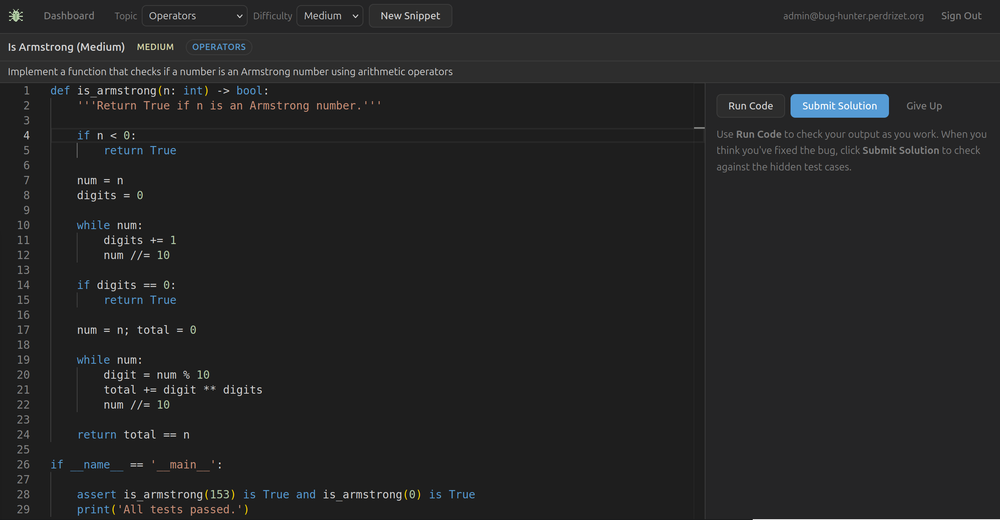

# Bug Hunter

[](https://github.com/gperdrizet/bug-hunter/actions/workflows/test.yml)
[](https://github.com/gperdrizet/bug-hunter/actions/workflows/deploy-staging.yml)
[](https://github.com/gperdrizet/bug-hunter/actions/workflows/deploy-prod.yml)
[](https://bug-hunter.perdrizet.org)

Simple educational tool for Python coding. Students are shown broken Python snippets and must fix them in-browser using a Monaco editor with Pyodide-powered test execution. Each snippet is produced by a three-pass LLM pipeline: the first pass generates a working solution, the second generates and verifies test cases against it, and the third introduces a bug and confirms it breaks at least one test.



## Using Bug Hunter

### Getting access

Bug Hunter is currently in closed beta. To request access, email **admin@bug-hunter.perdrizet.org**. Once you receive an invite code, register at:

**https://bug-hunter.perdrizet.org/register**


### How to use it

**1. Pick a topic and difficulty**

Use the dropdowns at the top of the page to choose a Python topic (e.g. *Loops*, *Functions*, *Classes*) and a difficulty level (*Easy*, *Medium*, or *Hard*), then click **New Snippet** (**Note:** snippet generation involves minimum three inference passes and may take up to 3 minutes depending on the length and complexity of the requested snippet).

**2. Find the bug**

You'll be shown a broken Python snippet in the editor. Read the description beneath the title to understand what the code is supposed to do, then find and fix the bug. All editing happens in the browser - no local Python installation needed.

**3. Test your fix**

- **Run Code**: executes your code and shows its output. Use this to check your logic as you work.
- **Submit Solution**: runs your fix against hidden test cases. All tests must pass to mark the problem solved.

**4. Stuck?**

Click **Give Up** to reveal the working solution, then click **Next Snippet** to move on.

### Topics covered

| Topic | Topic |
|---|---|
| Data Types | Comprehensions |
| Data Structures | Decorators |
| Operators | Generators |
| Loops | File I/O |
| Functions | Error Handling |
| Classes | Exceptions |

### Tracking progress

Your progress is saved automatically. Return to the **Dashboard** at any time to see your solve rate by topic.

## Development

### Prerequisites

- Docker (for PostgreSQL)
- Python 3.12+
- Node.js 18+

### First-time setup

**1. Configure environment**

```bash
cp .env.template .env
```

Edit `.env` and set at minimum:
- `SECRET_KEY`: any long random string for local dev
- `OPENAI_BASE_URL`: your LLM endpoint (e.g. `https://promptlyapi.com/v1`)
- `OPENAI_MODEL`: model name your endpoint accepts
- `OPENAI_API_KEY`: your API key

**2. Start PostgreSQL**

```bash
docker compose -f docker-compose.yml -f docker-compose.local.yml up db -d
```

The `docker-compose.local.yml` exposes the DB on `localhost:5433` (port 5432 is reserved for other services on this machine).

**3. Install backend dependencies**

```bash
cd backend
python3 -m venv .venv
.venv/bin/pip install -r requirements.txt
```

**4. Run database migrations**

```bash
cd backend
.venv/bin/alembic upgrade head
```

**5. Install frontend dependencies**

```bash
cd frontend
npm install
```

### Running locally

In one terminal, start the backend:

```bash
/home/siderealyear/bug-hunter/backend/.venv/bin/uvicorn app.main:app \
  --host 0.0.0.0 --port 8000 --reload \
  --app-dir /home/siderealyear/bug-hunter/backend
```

In another terminal, start the frontend:

```bash
cd frontend
npm run dev
```

Open **http://localhost:5173**. The Vite dev server proxies all `/api/*` requests to the backend on port 8000.

The backend API docs are available at **http://localhost:8000/docs**.

### Creating the first admin account

**1. Insert a one-time invite code into the DB**

```bash
PGPASSWORD=bughunter psql -h localhost -p 5433 -U bughunter bughunter \
  -c "INSERT INTO invite_codes (code, is_active) VALUES ('test123', true);"
```

**2. Register via the API**

```bash
curl -s -X POST http://localhost:8000/api/auth/register \
  -H "Content-Type: application/json" \
  -d '{"email":"admin@example.com","password":"password123","invite_code":"test123"}' \
  | python3 -m json.tool
```

**3. Promote the account to admin**

```bash
PGPASSWORD=bughunter psql -h localhost -p 5433 -U bughunter bughunter \
  -c "UPDATE \"user\" SET is_admin = true WHERE email = 'admin@example.com';"
```

Then log in at http://localhost:5173/login and use the **Admin > Generate** panel to test the LLM pipeline.

## Deployment

The project runs on a self-hosted VPS behind an nginx reverse proxy and uses two environments: staging and production. Both are deployed via GitHub Actions.

### CI/CD workflows

**Tests** (`test.yml`): runs on every pull request to `main`:
- `lint-backend`: ruff lint check of the backend
- `typecheck-frontend`: `npm run build` (runs `tsc -b`)

Both jobs must pass before a PR can be merged.

**Deploy Staging** (`deploy-staging.yml`): runs automatically on every push to `main`. Builds and starts containers on the staging server and runs a health check.

**Deploy Production** (`deploy-prod.yml`): manual dispatch only. Requires a `version` (e.g. `v0.1.0`) and `confirm` set to `deploy`. Builds and starts containers, health checks, then creates a git tag and GitHub release.

## Contributing

Bug reports, feature suggestions, and pull requests are welcome. Please open an issue first to discuss significant changes before submitting a PR. All pull requests must pass CI checks before they can be merged.

## License

This project is licensed under the [GNU General Public License v3.0](LICENSE).

